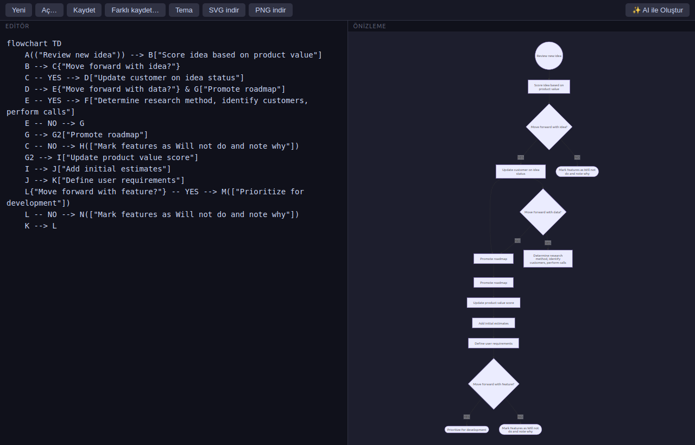
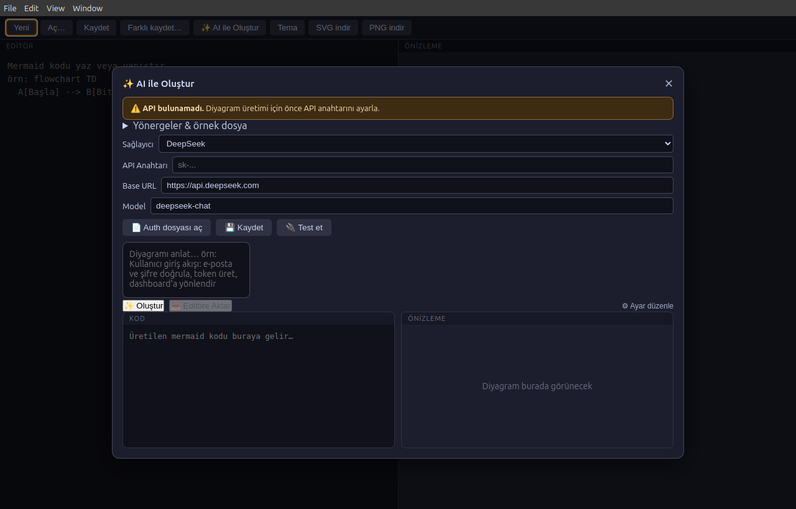

# Mermaid Editor

Masaüstünde `.mmd` dosyalarını açan, düzenleyen, canlı önizleyen ve **AI ile diyagram üreten** minimal bir Electron uygulaması.





## Özellikler
- Çift tıklama ile `.mmd` dosyalarını aç
- Solda editör, sağda **canlı önizleme** (yazdıkça güncellenir)
- Ctrl+S kaydet, SVG / PNG export, 5 tema
- **✨ AI ile Oluştur**: DeepSeek API ile doğal dilden Mermaid kodu üret (kod + önizleme popup içinde)
- Port yok, mermaid.js yerel — tamamen çevrimdışı çalışır

## Gereksinimler

- Node.js 20+ (Electron ve mermaid için)

## Kurulum (Linux)

```bash
cd Mermaid-Editor
npm install
./install.sh        # menü/çift tıklama için .desktop + .mmd dosya ilişkilendirmesi kurar
```

Çalıştırma: `npm start` veya `./node_modules/.bin/electron .`

## AI özelliği (DeepSeek)

1. `✨ AI ile Oluştur` butonuna bas
2. API ayarı yoksa: **Auth dosyası aç** ile `api-settings.json`'u düzenle veya formu doldurup **Kaydet**, sonra **Test et**
3. Ayar dosyası konumu: `api-settings.json` (uygulama klasörünün içinde)

```json
{
  "provider": "deepseek",
  "apiKey": "sk-...",
  "baseUrl": "https://api.deepseek.com",
  "model": "deepseek-chat"
}
```

## Geliştirme

```bash
npm install
npm start
```

## Dosya yapısı

```
main.js          Electron ana süreç (pencere, dosya I/O, AI API çağrıları)
preload.js       Güvenli IPC köprüsü
renderer.html    Arayüz (editör + önizleme + AI popup)
renderer.js      Arayüz mantığı (canlı önizleme, AI akışı)
install.sh       Linux kurulumu (.desktop + MIME ilişkilendirme)
```

## Lisans

MIT

## Teşekkürler

Bu proje aşağıdaki açık kaynak projelerden yararlanır / ilham alır:

- **[mermaid-js/mermaid](https://github.com/mermaid-js/mermaid)** — Diyagram render motoru (npm bağımlılığı olarak kullanılıyor).
- **[mermaid-js/mermaid-live-editor](https://github.com/mermaid-js/mermaid-live-editor)** — Editör + canlı önizleme arayüz tasarımının ilham kaynağı.
- **[1jehuang/mermaid-rs-renderer](https://github.com/1jehuang/mermaid-rs-renderer)** — Geliştirme sürecinde hızlı (tarayıcısız) render araştırması; `mmdr` CLI aracı yerelde hızlı SVG üretimi için kurulu.
- **[lukilabs/beautiful-mermaid](https://github.com/lukilabs/beautiful-mermaid)** — Tema ve görsel estetik araştırması.
